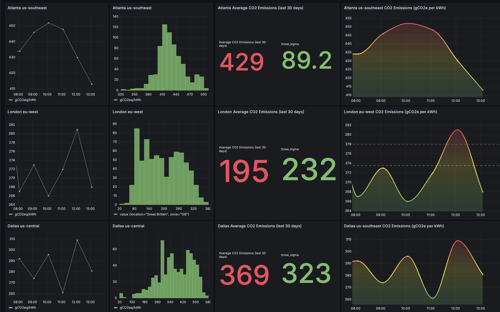

# Readme File 

This repo contains the colleteral necessary to deploy your own CO2 Electricty Grid Intensity monitor for Akamai Cloud Computing. 

More details available on this resources:

Blog Post link: 
Youtube Instructional Video Link: 

Here are list of the files contained and there are usage: 

1) readme.readme - This file here :) 
2) LinodeCO2EmissionsDashboard.json - example Grafana dashboard that displays various statistics around the electricty in terms of CO2 grams equivalent per KwH of electricity used.
3) fetch_co2_data.sh -bash script to query Electricity Maps API to get current CO2 Intensity of grid in use 
4) linode_akamai_locations_grid.csv - mapping of Linode Global Core Cloud Compute Locations against Electricity Grids 
5) zones.csv - list of electricity zones from Electricity Maps including country code and grid operator name. 

## How it works 

Follow the instructional video which shows how to run the stackscript which will setup the basic Grafana and InfluxDB stack. 
The fetch_co2_data.sh is scheduled to run every hour in crontab to collect data from Electricity Maps API, updates to Electricity Maps data are currently every hour. The data is placed in buckets in the InfluxDB instance according to the Linode given name for a location example us-southeast as per the Linode API. 
The dashboard LinodeCO2EmissionsDashboard.json gives an example of a few graphs for some locations, simply copy the charts and make new ones for new locations by modifying the bucket that is being queried and also changing the title on the charts to reflect the bucket change. 
linode_akamai_locations_grid.csv is a mapping between the regions in Electricity Maps and the Akamai Core Cloud Compute locations. 

Here is a list of 15/1/25 of the sites and the corresponding buckets.
This list is maintained in linode_akamai_locations_grid.csv
The bucket uses the standard Linode Location ID in the first column below. 

| Location       | Country Code | Zone Name                          | Display Name   |
|----------------|--------------|------------------------------------|----------------|
| us-southeast   | US           | Southern Company Services          | US-SE-SOCO     |
| us-ord         | US           | PJM interconnection                | US-MIDA-PJM    |
| us-central     | US           | Electric Reliability Council of Texas | US-TEX-ERCO |
| us-west        | US           | California ISO                     | US-CAL-CISO    |
| us-lax         | US           | California ISO                     | US-CAL-CISO    |
| us-mia         | US           | City of Homestead                  | US-FLA-HST     |
| us-east        | US           | PJM interconnection                | US-MIDA-PJM    |
| us-sea         | US           | Puget Sound Energy                 | US-NW-PSEI     |
| us-iad         | US           | PJM interconnection                | US-MIDA-PJM    |
| ca-central     | CA           | Ontario                            | CA-ON          |
| nl-ams         | NL           | Netherlands                        | NL             |
| it-mil         | IT           | Central North Italy                | IT-CNO         |
| eu-west        | UK           | Great Britain                      | GB             |
| gb-lon         | UK           | Great Britain                      | GB             |
| fr-par         | FR           | France                             | FR             |
| es-mad         | ES           | Spain                              | ES             |
| eu-central     | DE           | Germany                            | DE             |
| de-fra-2       | DE           | Germany                            | DE             |
| se-sto         | SE           | South Central Sweden               | SE-SE3         |
| sg-sin-2       | SG           | Singapore                          | SG             |
| jp-osa         | JP           | Kansai                             | JP-KN          |
| ap-northeast   | JP           | Tokyo                              | JP-TK          |
| jp-tyo-3       | JP           | Tokyo                              | JP-TK          |
| in-maa         | IN           | Southern India                     | IN-SO          |
| in-bom-2       | IN           | Western India                      | IN-WE          |
| id-cgk         | ID           | Indonesia                          | ID             |
| br-gru         | BR           | South Brazil                       | BR-S           |
| ap-southeast   | AU           | New South Wales                    | AU-NSW         |
| au-mel         | AU           | Victoria                           | AU-VIC         |

EmissionsDashboardSample.png

## Linode Firewall Requirements 

In order to access the deployment there are number of ports in use 

InfluxDB - Port 8086 

Grafana - Port 3000

SSH - Port 22 (required for command line access to the instance) 

## Some known limitations 

- This is using the free tier of Electricity Maps which only provides the current live data for forecasted CO2 Intensity of the grids it is required to have a paid for subscription to Electricity Maps API https://www.electricitymaps.com/free-tier-api 
- In Electricity Maps some grids and Akamai Cloud Compute Locations do not have real time CO2 intensity information, example Jakarta, IN
- 
  

